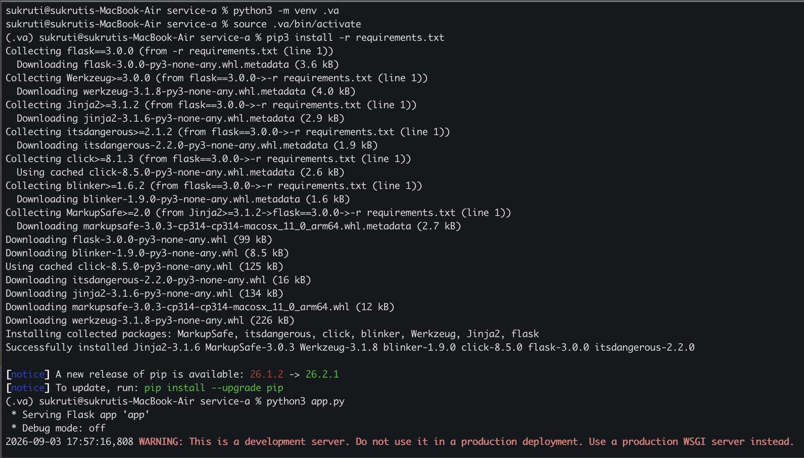
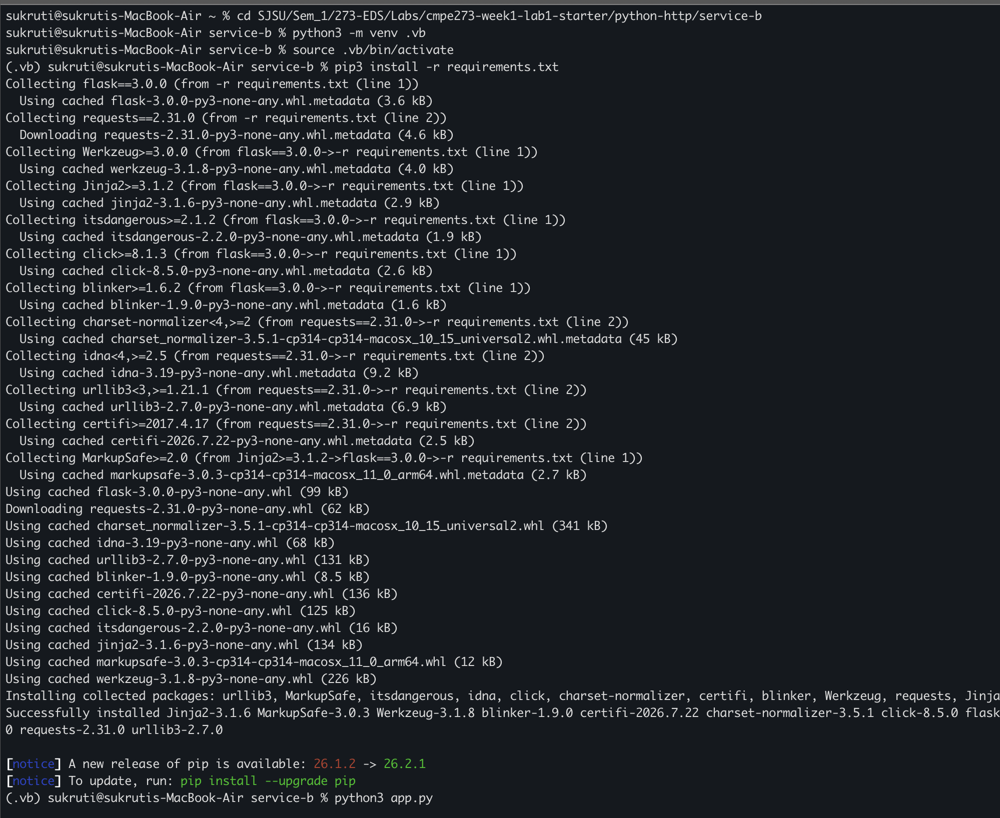
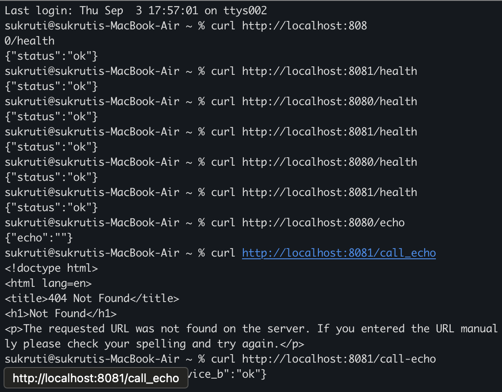
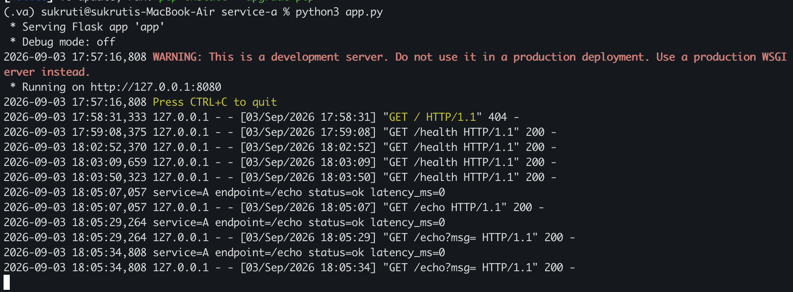
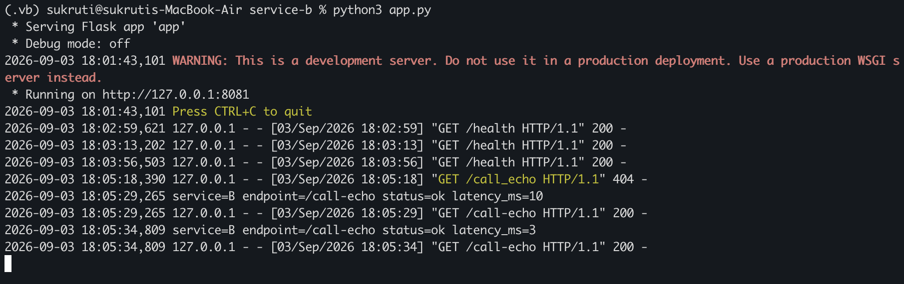
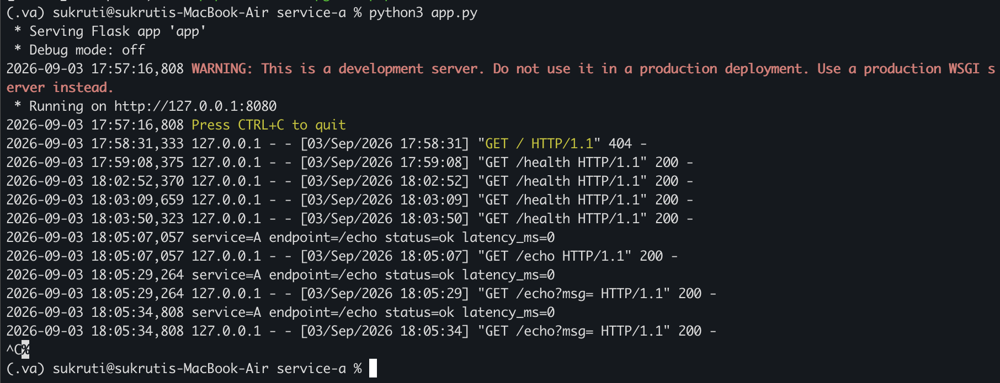
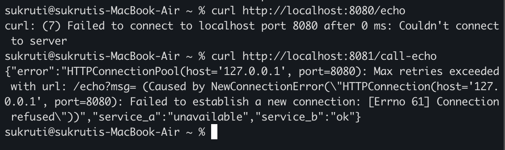
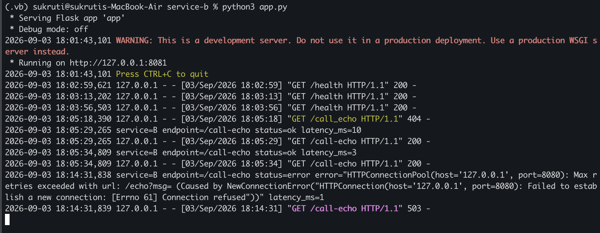

# CMPE 273 – Week 1 Lab 1: Your First Distributed System (Starter)

## 1) Running both the services locally
- **Service A** running on (port 8080): 

  

- **Service B** running on (port 8081): 

   

## 2) Running **curl** commands for both the services

   

   - ## **Service A** logs: 

      

   - ## **Service B** logs: 

      

## 3) **Service A** stopped

   

   - ## Running **curl** commands after service A is stopped

      

   - ## **Service B** logs:
 
      

## 4) What makes this distributed?

   - Both the services A and B are running independently and communicating through network, even when they are physically on the same machine. So, if we were to run these services on different machines, given that both the services can communicate through the network, the services would run the same way. This separation is what makes the services distributed.